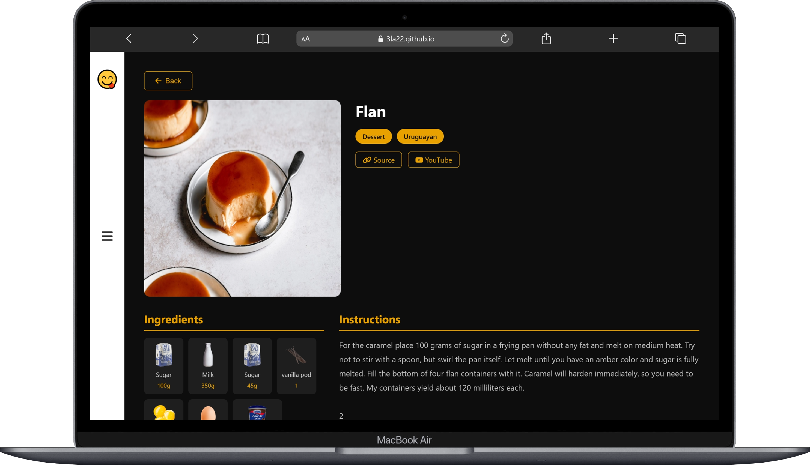
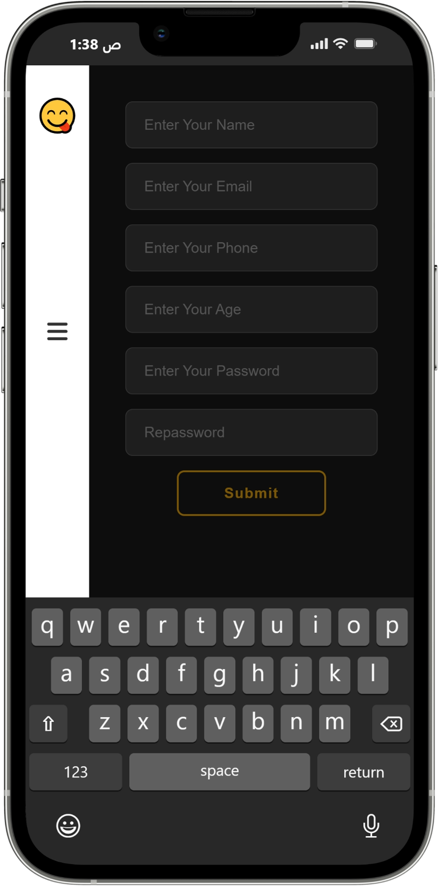
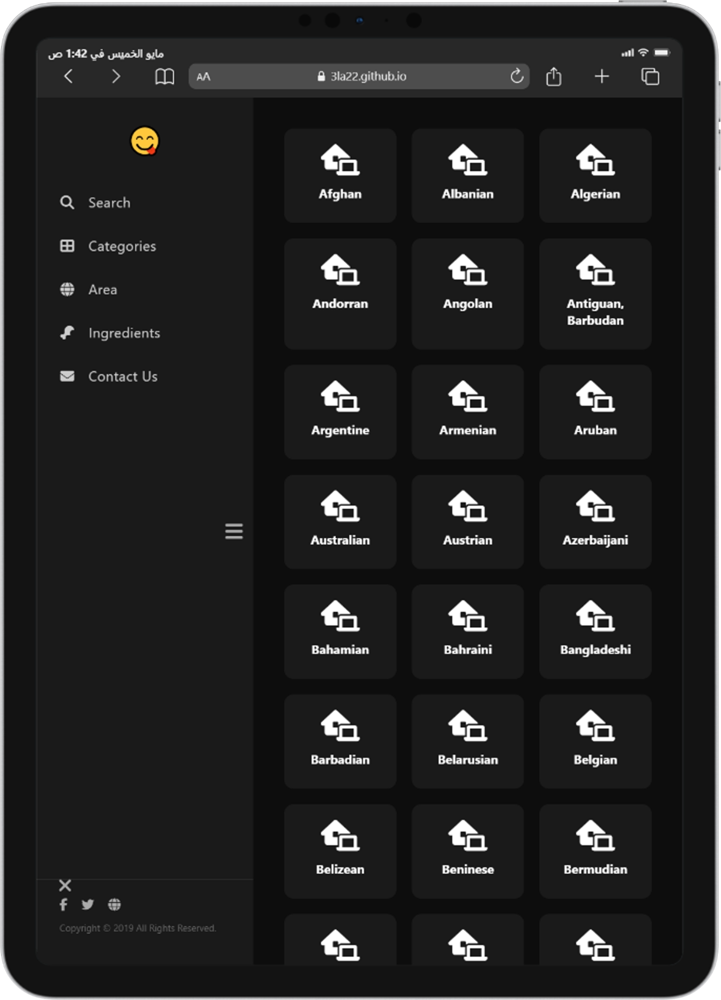

# Yummy 🍽️
A responsive food recipe web app to browse, search, and explore thousands of meals from around the world. Filter by category, country, or ingredient and view full details including instructions and cooking videos.

## 🔗 Live Demo
https://3la22.github.io/Yummy/

## 📸 Screenshots

## 🛠️ Built With
- HTML
- CSS
- JavaScript

## ✨ Features
- Browse meals on the home page
- Search by meal name or first letter
- Filter by category, area, or ingredient
- View full meal details with ingredients and instructions
- Sign up form with regex validation
